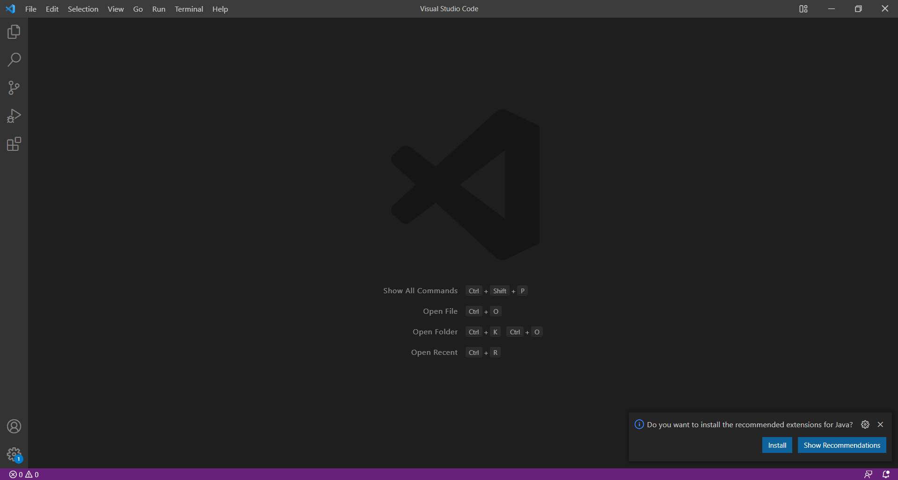
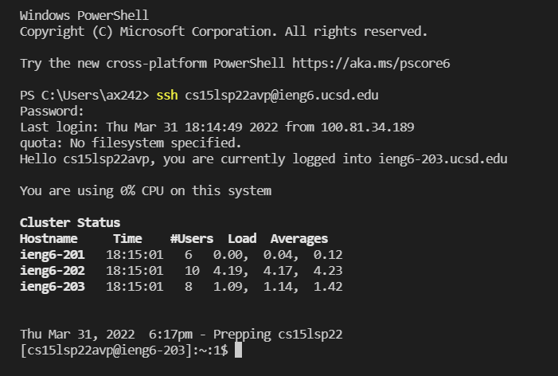
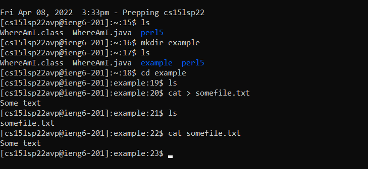
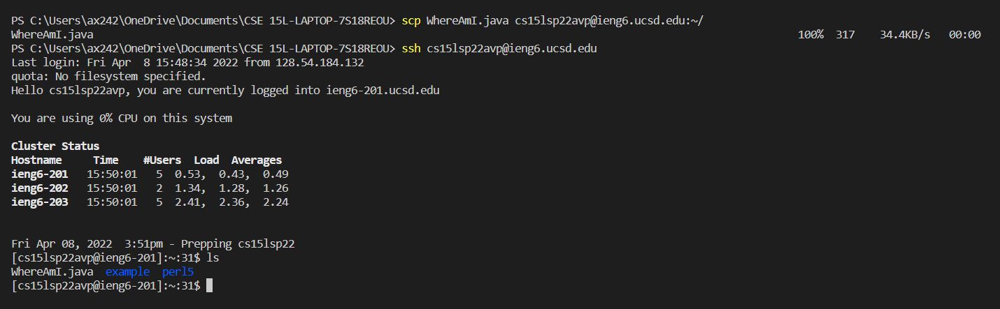
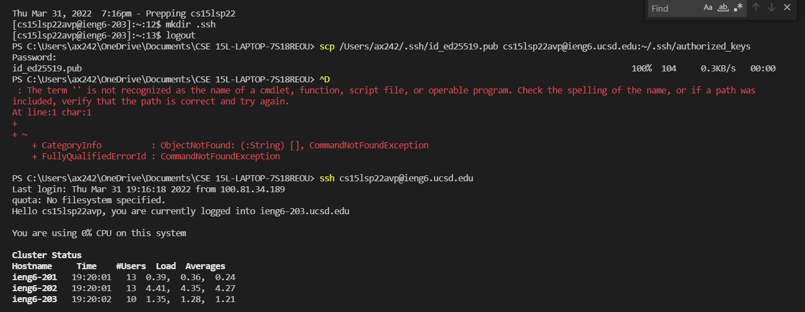
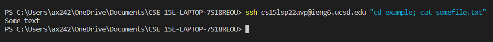

# Lab Report 1

[Home](..\index.md)

## Setup, Remote Access, and UNIX Commands
*Alvin Xiao, March 31, 2022*

This report will be a tutorial on how to log into a course-specific account on `ieng6`, as well as other useful features one can use through this remote connection. 
___

### **Installing VS Code**

To install VS Code, simply go [here](https://code.visualstudio.com/) and download the right one for your operating system. After it finishes installing, it should look something like the image below:

### **Remotely Connecting**

To log into a course-specific account, know the user of the account. Then, type `$ ssh cs15lsp22___@ieng6.ucsd.edu` and fill in the blank with the unique user. Enter the password and it will look something like this:

### **Trying Some Commands**

There are many different UNIX commands to run. Some examples are:
- `$ cd`
- `$ ls`
- `$ mkdir`
- `$ cat`

In the image below, an *example* directory is created, as well as a text file with some text in it. The image shows what commands were used to achieve this.

### **Moving Files with SCP**

SCP allows files to be transferred from the client to the host server. Run `$ scp <file name> cs15lsp22___@ieng6.ucsd.edu:~/` in order to do so.

### **Setting an SSH Key**

To set up an SSH key, generate a pair of public and private keys. Then, store the public key on the remote server so that it is possible to log in without a password, as shown below.

### **Optimizing Remote Running**

It is possible to run commands without logging into the course specific account. Follow this format: `$ ssh cs15lsp22___@ieng6.ucsd.edu "<command>"`. More than one command can be run with a semicolon.

