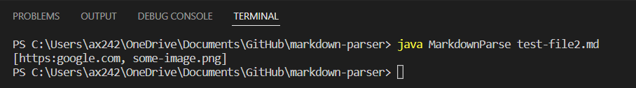
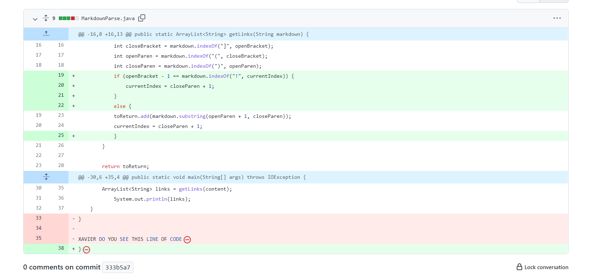
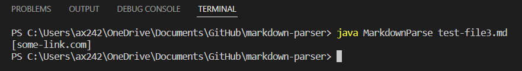
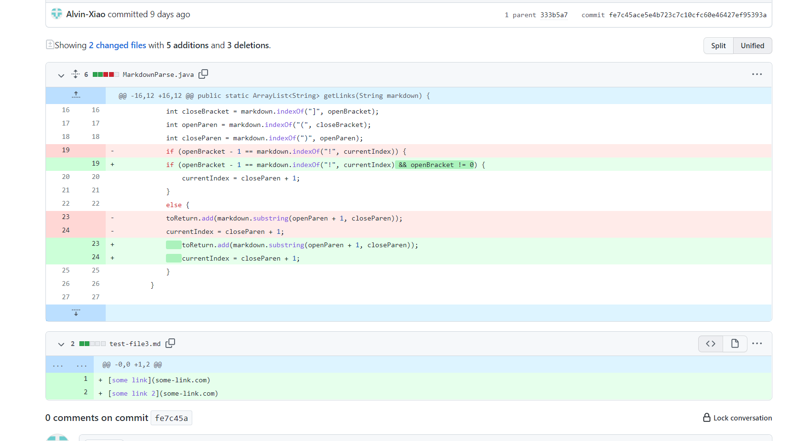
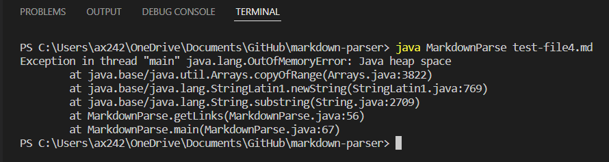
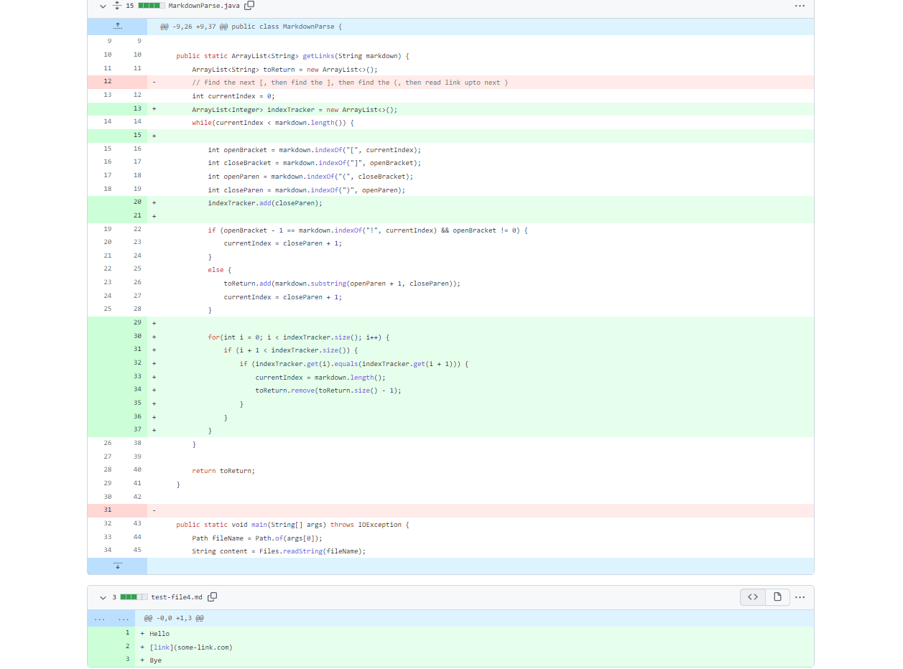

# Lab Report 2

[Home](index.md)

## Incremental Development: Debugging One at a Time
*Alvin Xiao, April 14, 2022*

This report demonstrates the debugging process of identifying bugs and their symptoms, and then making the appropriate corrections to the code.

___

### Bug 1: Failure to Identify Images

Using this [failure-inducing input](https://raw.githubusercontent.com/Alvin-Xiao/markdown-parser/main/test-file2.md), there should only be one link printed. However, the output prints out both contents within the parentheses, even if the second one was an image.

This suggests that the code cannot distinguish between normal links and images, and thus causes the code to print out any pair of parentheses it observes in the test file. Here was the change made to fix this.

### Bug 2: Mistaking Normal Links as Images

Now, the code can identify images. However, it also wrongly identifies normal links as images, as seen from this [failure-inducing input 2](https://raw.githubusercontent.com/Alvin-Xiao/markdown-parser/main/test-file3.md) and  output.

There are two links in the test file, meaning both should be printed in the output. But the code only prints one link. The bug is that the code examines the index right before the open bracket, and determines whether it is equal to the index of `!`. Since both equate to -1, this causes the said symptom. This can be fixed by adding another condition.

### Bug 3: Out of Memory Error

If the link is not the last component of the file, then the program will fail and run an infinite loop, as tested by this [failure-inducing input 3](https://raw.githubusercontent.com/Alvin-Xiao/markdown-parser/main/test-file4.md) and output.

This is because the while loop in the code will only stop running when the current index reaches the end of the markdown file. However, the current index keeps setting itself to a certain index that never changes, and thus keeps the loop running. Here is a fix to that problem.

