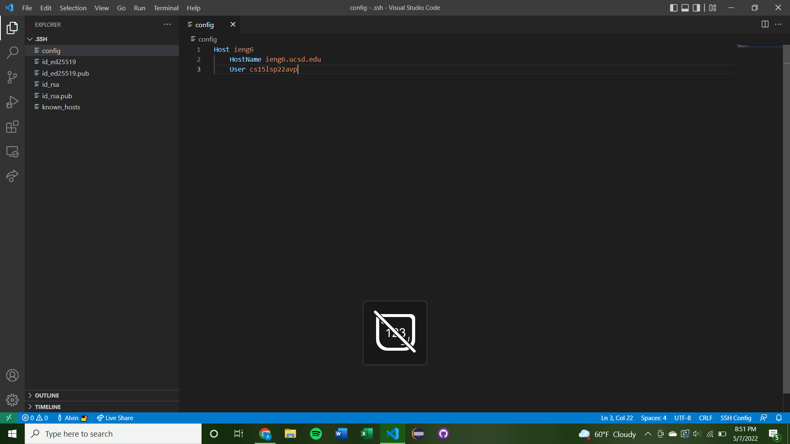
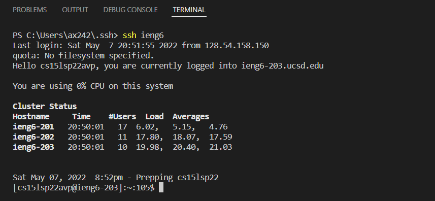
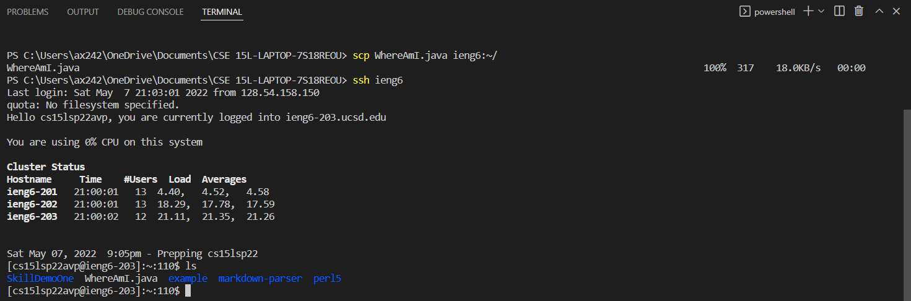
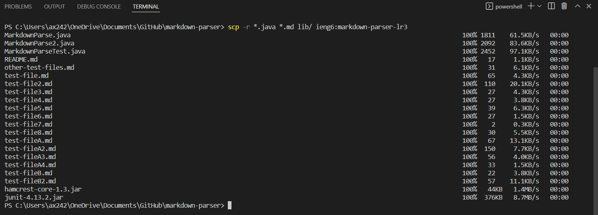
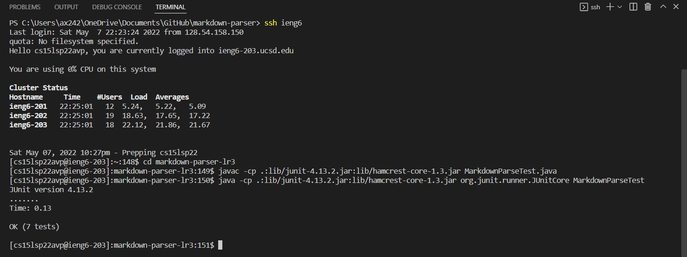
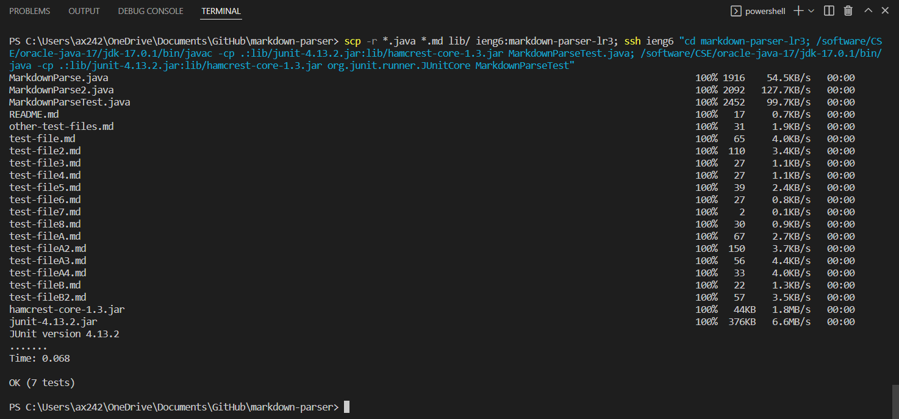

# Lab Report 3

[Home](index.md)

## SSH, GitHub Access, and SCP
*Alvin Xiao, April 28, 2022*

This report focuses on making remote running more convenient and efficient.

___

### Streamlining SSH Configuration

Rather than typing out the entirety of my course specific account, I can use an alias and type `ssh <alias>` instead. This is done through a configuration file in the `.ssh` folder that identifies the host and user, as shown below.

We can confirm that this works by typing `ssh <alias>` (here I chose *ieng6* as an alias).

This alias also works with `scp` and copying files.

### Copying Whole Directories With SCP

The command `scp <file> <alias>` will only function for single files. In order to copy directories that contain more than one file, `scp` must be called recursively by using `-r`.

In the image above, all .java and .md files and the lib folder of the current directory will be copied over to the specified remote directory. 

The code was copied and works fine, as shown above. But these commands can be condensed into one line!

