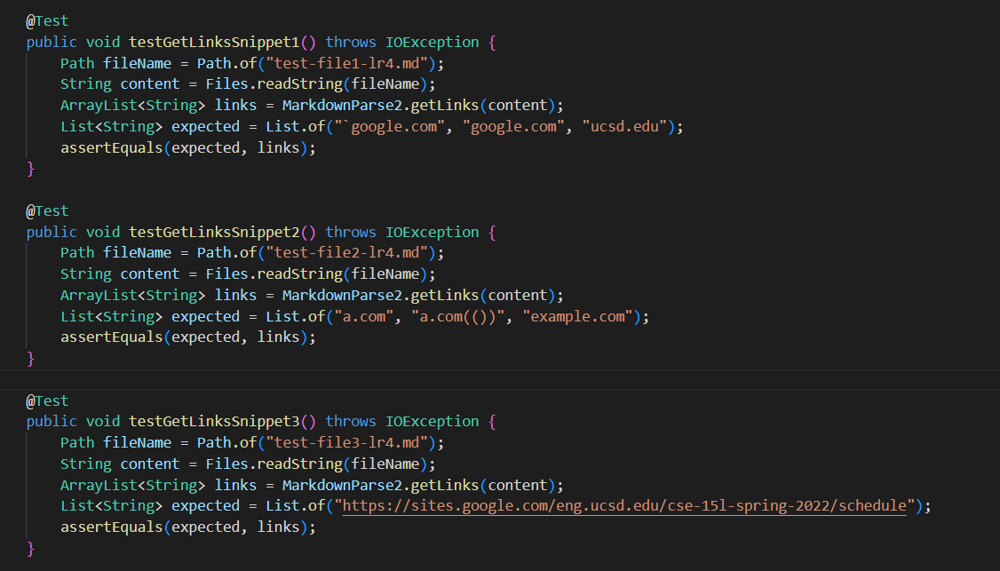
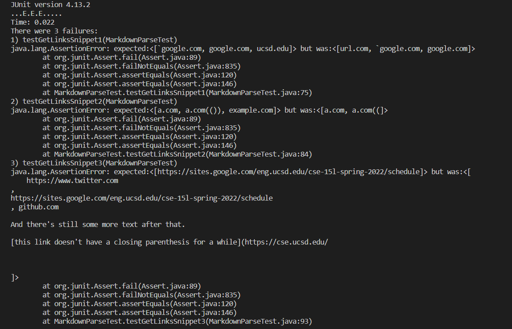
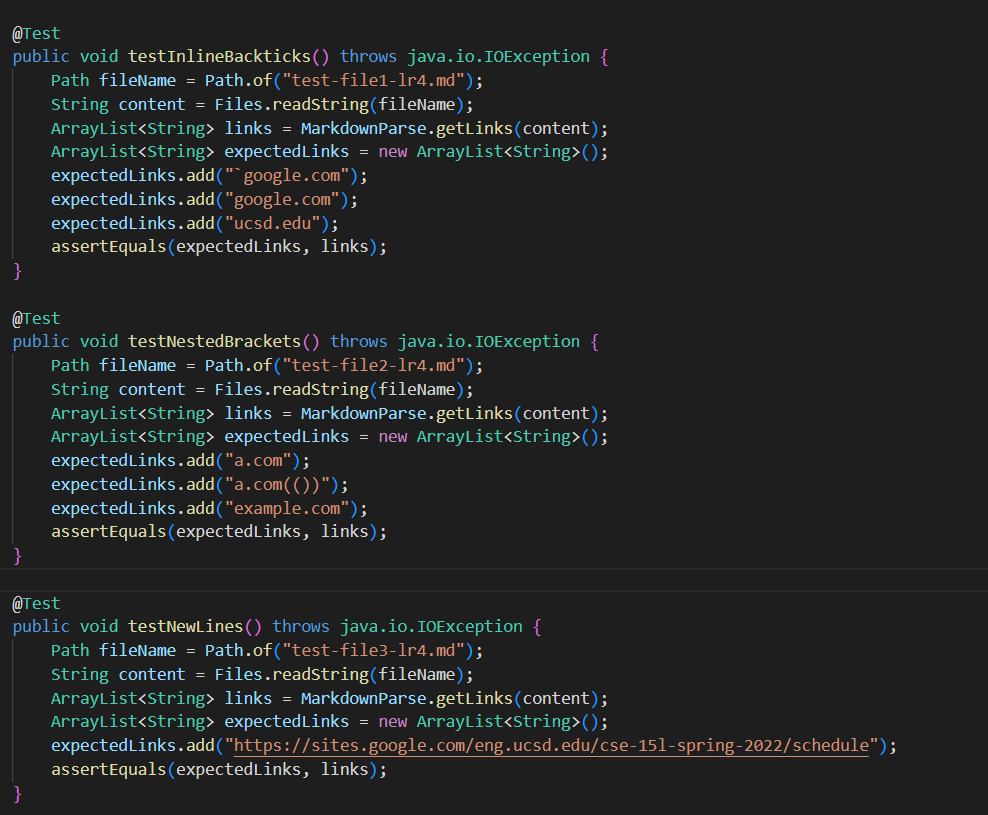
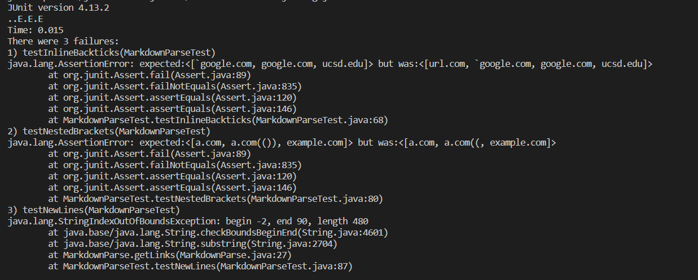

# Lab Report 4

[Home](index.md)

## Implementations of Markdown Parser
*Alvin Xiao, May 12, 2022*

This report discusses additional tests ran on my markdown parser and the markdown parser reviewed during lab 7. [The CommonMark demo site](https://spec.commonmark.org/dingus/) was used to test which links were valid links. The repository links are ```https://github.com/Alvin-Xiao/markdown-parser.git``` and ```https://github.com/szreik/markdown-parser.git```.

___

### My Implementation

The following picture shows the test methods created to test each snippet of code.



However, running the tests showed three failures.



### Snippet 1

Specifically for my implementation, I do not think ten lines of code will be enough to account for inline code with backticks. In order to do so, I would not only need to find the first backtick, but also check how many other backticks exist. If I had a similar method for open and closed brackets, it would be simpler to implement it so.

### Snippet 2

I believe that it would be possible to add less than ten lines of code to work for nested parentheses, brackets, and escaped brackets. I could set up a counter and measure whether the number of open brackets is equal to the number of closed brackets, to prevent the program from stopping at the first closed bracket.

### Snippet 3

It might not be possible to make a small change to account for new lines and line breaks within the brackets and parentheses. Checking a string for new lines and line breaks requires several lines of code in itself, and then implementing it into the while loop will  result in a larger change.

___

### Implementation From Lab 7

Similar test methods were developed for this other implementation of markdown parser.



However, running the tests also showed three failures.

