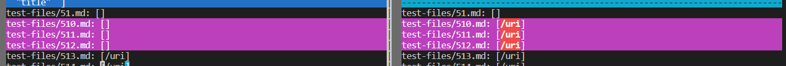
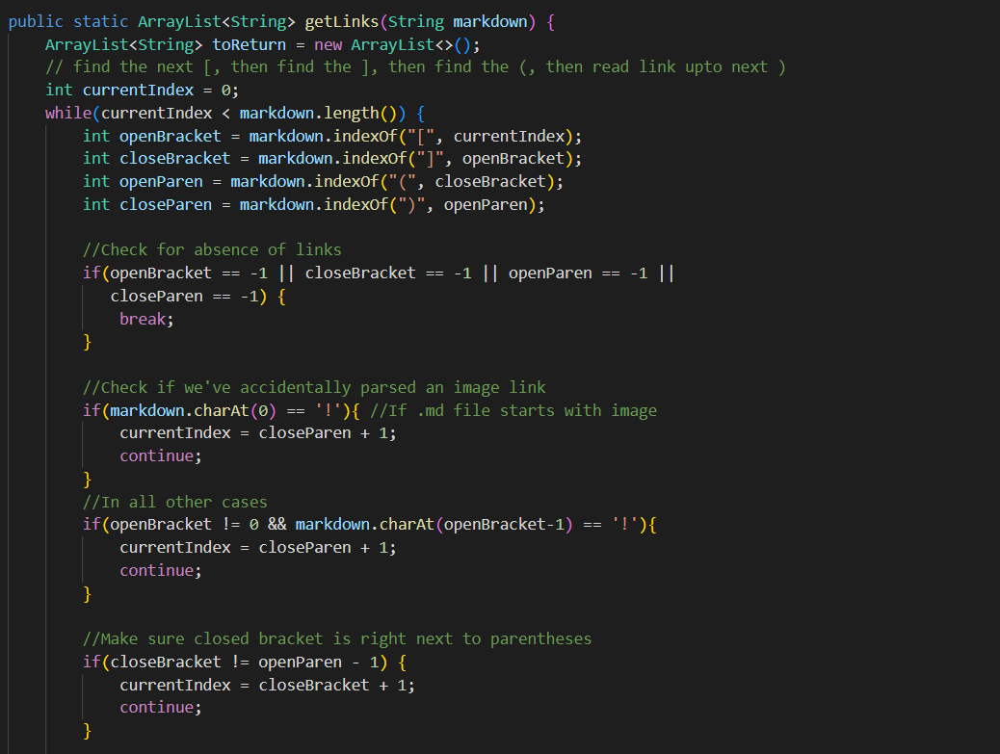

# Lab Report 5

[Home](index.md)

## Implementations of Markdown Parser
*Alvin Xiao, May 26, 2022*

This report discusses two particular tests from a directory of 652 tests that were ran on both a provided implementation and my implementation of a markdown parser. These differences were found by saving the outputs of all the test files to two text files and comparing them using ```vimdiff```. To decide the expected output, [the CommonMark demo site](https://spec.commonmark.org/dingus/) was used.

___

### Test 510

[Here](https://github.com/nidhidhamnani/markdown-parser/blob/main/test-files/510.md) is the link to test 510. 

The outputs of both implementations can be seen in the image below, with my implementation on the *left* and the provided implementation on the *right*.



My output is correct for this test case. The expected output is ```[]```, an empty list. The syntax is formatted incorrectly, and thus there are no links in the file when the provided implementation still puts ```/uri```.

The bug in the provided implementation is that the program does not account for cases where the open parenthesis is not right next to the closed bracket, as shown in the image below.


The code can be adjusted to continue the while loop if the open parenthesis and closed bracket are not right next to each other. The index values should be updated as well.

### Test 194

[Here](https://github.com/nidhidhamnani/markdown-parser/blob/main/test-files/194.md) is the link to test 194. 

Again, the outputs of both implementations can be seen in the image below, with my implementation on the *left* and the provided implementation on the *right*.


Neither implementation is correct for this test case. This is because neither implementation considers markdown reference links. The expected output is ```[my_(url)]```.

Referring to my implementation for a fix to the bug, there would need to be a section of code checking for reference links. This could be added to my get links method as a helper method, as shown below.

